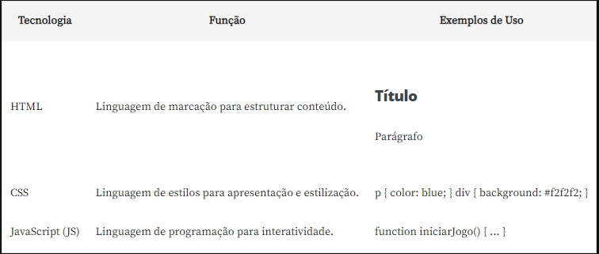
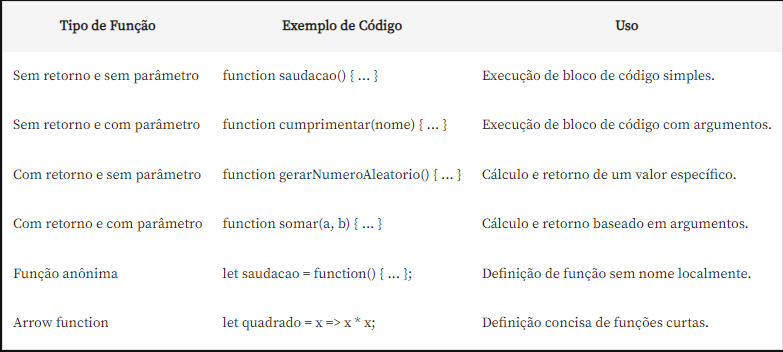
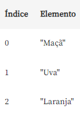

__Módulo 01__  

HTML, CSS e JavaScript (JS) são três tecnologias fundamentais para o desenvolvimento web.

O HTML (HyperText Markup Language) é a linguagem de marcação utilizada para estruturar o conteúdo de uma página web. Essa linguagem usa tags para definir a hierarquia dos elementos de uma página. Originado em 1991 por Tim Berners-Lee, o HTML é como o esqueleto de uma página web: trabalha organizando o conteúdo, como títulos, parágrafos, imagens e links, para que tudo fique bem arrumado e no lugar certo.

O CSS (Cascading Style Sheets), criado em 1995, é destacado como uma linguagem de estilos. Ele separa a apresentação da estrutura: é responsável pela apresentação e estilização dos elementos, pois permite controlar cores, fontes, layouts e outros aspectos visuais. É como vestir a estrutura HTML com roupas elegantes para que a página pareça exatamente como você deseja.

O JavaScript, por sua vez, é a única linguagem de programação das três. É responsável por adicionar interatividade e dinamismo às páginas. Possibilita a criação de funcionalidades como animações, validações de formulários e atualizações de conteúdo em tempo real.

O papel de cada tecnologia dessas na construção de aplicações web, de forma bem resumida, é: o HTML estrutura o conteúdo, o CSS define o estilo e o layout, e o JavaScript adiciona funcionalidades dinâmicas.



A aprendizagem dessas tecnologias é crucial para qualquer pessoa interessada em desenvolvimento web, uma vez que elas formam a base do ambiente digital. Compreender o HTML é necessário para estruturar e organizar o conteúdo de uma página de maneira semântica, o que é vital para a acessibilidade, indexação por motores de busca e uma experiência consistente entre diferentes dispositivos.

O CSS permite que pessoas desenvolvedoras controlem o design e a aparência de seus sites, possibilitando a criação de layouts atraentes e responsivos, que se adaptam a diferentes tamanhos de tela.

Por fim, o JavaScript capacita os desenvolvedores e as desenvolvedoras a criar experiências interativas e dinâmicas, e melhorar a usabilidade ao oferecer às pessoas usuárias funcionalidades mais avançadas.

A proficiência em HTML, CSS e JavaScript permite materializar ideias de maneira criativa e funcional, o que proporciona aos usuários finais uma experiência envolvente e intuitiva.

Além disso, essas habilidades são altamente valorizadas no mercado de trabalho, visto que a demanda por pessoas desenvolvedoras web qualificadas é constante, dada a importância contínua da presença online para empresas e indivíduos. Portanto, aprender e aprimorar essas tecnologias é um investimento significativo para qualquer pessoa que deseja se destacar na área de desenvolvimento web.

* https://www.alura.com.br/artigos/html-css-e-js-definicoes

__Módulo 02__  
As funções desempenham um papel central na programação e no desenvolvimento de software, permitindo encapsular blocos de código reutilizáveis e executáveis. Elas podem ser definidas para executar tarefas específicas, desde cálculos simples até manipulação complexa de dados. As funções em JavaScript podem ter ou não parâmetros, bem como retornar ou não valores.



Seu uso é essencial para criar aplicações dinâmicas, interativas e eficientes em JavaScript. Porém, não é necessário a criação de todos os tipos de funções neste momento. Acompanhe as aulas e saiba que essas variações existem e conforme a necessidade, vamos mergulhando cada vez mais profundamente em lógica e JavaScript.

__Módulo 03__  
Uma array no JavaScript é uma estrutura de dados que permite armazenar e organizar vários valores em uma única variável. Os valores em uma array podem ser de qualquer tipo de dado, como números, strings, objetos, outras arrays e assim por diante. As arrays em JavaScript são indexadas, o que significa que cada valor dentro dela é associado a um índice numérico, começando geralmente do índice 0.

Criando uma array
Para criar uma array em JavaScript basta declarar uma variável e atribuir-lhe valores entre colchetes [].
```javascript 
let frutas = ["Maçã", "Uva", "Laranja"];
```

***Acessando valores***  
Os elementos de uma array são acessados usando índices numéricos, que começam em 0.


```javascript
console.log(frutas[0]); // Saída: "Maçã"
console.log(frutas[2]); // Saída: "Laranja"
```

***Adicionando novos elementos***  
Para adicionar um elemento ao final da array, você pode usar o método _push_.
```javascript
frutas.push("Morango");
console.log(frutas); // Saída: ["Maçã", "Uva", "Laranja", "Morango"]
```

***Removendo último elemento***  
Para remover o último elemento, você pode usar o método _pop_.
```js
frutas.pop();
console.log(frutas); // Saída: ["Maçã", "Uva", "Laranja"]
```