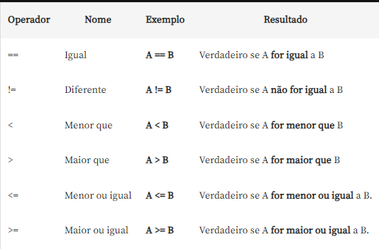
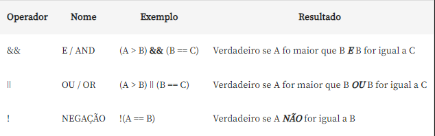

# Links úteis para estudo

__Módulo 01__
* https://developer.mozilla.org/pt-BR/docs/Learn/JavaScript/First_steps/What_is_JavaScript
* https://www.alura.com.br/artigos/javascript

__Módulo 02__  
No JavaScript, o uso do ponto e vírgula (;) é uma prática recomendada. A linguagem possui um mecanismo chamado "inserção automática de ponto e vírgula" (automatic semicolon insertion - ASI), que tenta adicionar ponto e vírgulas automaticamente em certos pontos do código onde eles são ausentes.

Isso significa que, em alguns casos, o JavaScript tentará "corrigir" a falta de ponto e vírgula inserindo-o automaticamente. No entanto, a interpretação do ASI pode levar a comportamentos inesperados e erros sutis, especialmente quando as regras não são claras.

Portanto, para evitar possíveis problemas e garantir a clareza do código, muitos desenvolvedores preferem adicionar explicitamente ponto e vírgula em seus programas.

Apesar da inserção automática de ponto e vírgula poder ajudar a mitigar erros de sintaxe, é uma boa prática adicionar ponto e vírgula manualmente para evitar ambiguidades e problemas de interpretação. Isso é particularmente importante em situações como quando várias instruções estão em uma mesma linha, ao usar declarações de retorno de valor ou ao minificar o código.

Em projetos colaborativos ou de grande escala, a consistência no estilo de codificação e a clareza do código são cruciais, e o uso explícito de ponto e vírgula contribui para um código mais legível e menos sujeito a erros de interpretação por parte dos programadores e do próprio mecanismo de ASI.

* https://developer.mozilla.org/pt-BR/docs/Web/JavaScript/Reference/Lexical_grammar#automatic_semicolon_insertion
* https://pt.stackoverflow.com/questions/3341/utilizar-ou-n%C3%A3o-ponto-e-v%C3%ADrgula-no-fim-das-linhas-em-javascript

__Módulo 03__  
Quando escrevemos programas em JavaScript, frequentemente nos deparamos com a necessidade de tomar decisões com base em condições. É aqui que os operadores lógicos entram em cena e nos ajudam a criar uma lógica robusta e eficaz.

## AND (&&)
O operador AND, representado pelos símbolos "&&", é utilizado para combinar duas condições e avaliar se ambas são verdadeiras. Se ambas as condições forem verdadeiras, o resultado será… verdadeiro. Caso contrário, logicamente será falso. Por exemplo:
```javascript
let idade = 25;
let possuiCarteira = true;

// se idade é maior que 18 e possui carteira…
if (idade > 18 && possuiCarteira) {
  console.log("Pode dirigir!");
} else {
  console.log("Não pode dirigir.");
}
```

## OR(||)
O operador OR, representado pelos símbolos "||", é usado para verificar se pelo menos uma das condições é verdadeira. Se uma das condições for verdadeira, o resultado será verdadeiro. Se ambas forem falsas, o resultado será falso. Veja um exemplo:
```js
let temMaça = false;
let temBanana = true;

// se tem maça ou tem banana…
if (temMaça || temBanana) {
  console.log("Você tem frutas!");
} else {
  console.log("Não tem frutas.");
}
```

## Operadores lógicos



* https://www.alura.com.br/artigos/operadores-matematicos-em-javascript

__Módulo 04__
Compreender cada linha de código ou comando em detalhes é certamente uma aspiração louvável, mas não é necessário decorar. O desenvolvimento de software moderno é uma tarefa complexa, e as linguagens de programação oferecem uma ampla gama de recursos e bibliotecas.

Em vez de memorizar cada linha, é mais valioso entender os conceitos fundamentais por trás das estruturas de programação e saber como usar a documentação efetivamente.

A documentação de uma linguagem de programação é uma ferramenta essencial para todos os desenvolvedores. Ela não apenas fornece uma referência rápida para a sintaxe e os comandos, mas também explica os conceitos subjacentes, oferece exemplos práticos e ajuda a compreender os diferentes recursos disponíveis.

Através da documentação você pode aprender a utilizar bibliotecas, explorar casos de uso avançados e entender as melhores práticas recomendadas pela comunidade. Isso economiza tempo, evita erros e permite que você se mantenha atualizado com as últimas atualizações da linguagem.

Em vez de se preocupar em memorizar cada detalhe, concentre-se em desenvolver habilidades de resolução de problemas, compreender os princípios de design de software e aprender a pesquisar eficientemente na documentação. A capacidade de ler e interpretar a documentação é uma habilidade valiosa, pois permite que você aprenda novas linguagens e tecnologias de maneira eficaz, adaptando-se rapidamente às mudanças do cenário de desenvolvimento. Portanto, em sua jornada como pessoa desenvolvedora, lembre-se de que a habilidade de compreender e usar a documentação é tão importante quanto saber escrever código.

* https://developer.mozilla.org/pt-BR/docs/Web/JavaScript/Reference/Global_Objects/Math/random
* https://www.w3schools.com/js/default.asp